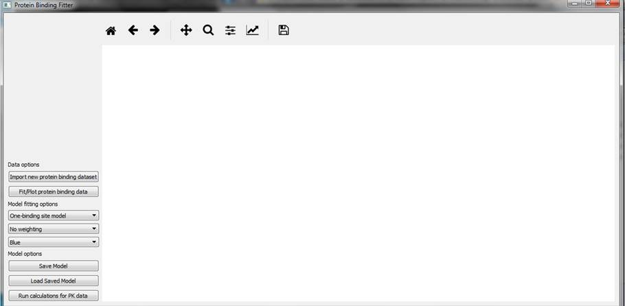
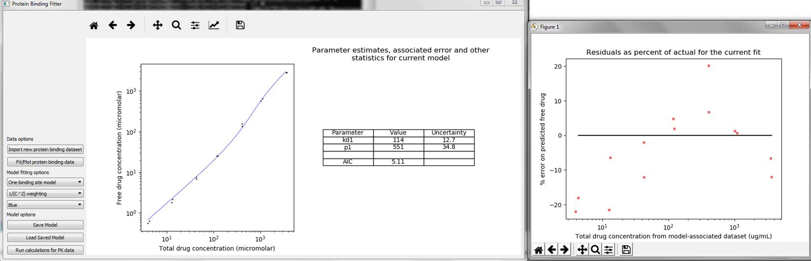
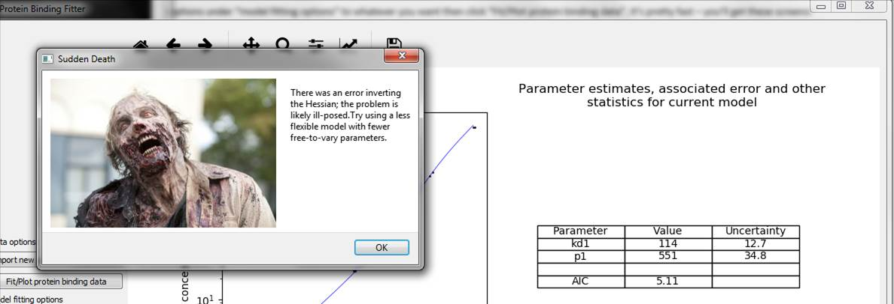
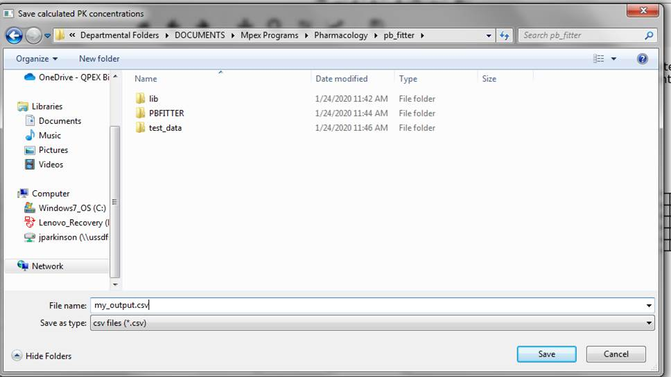
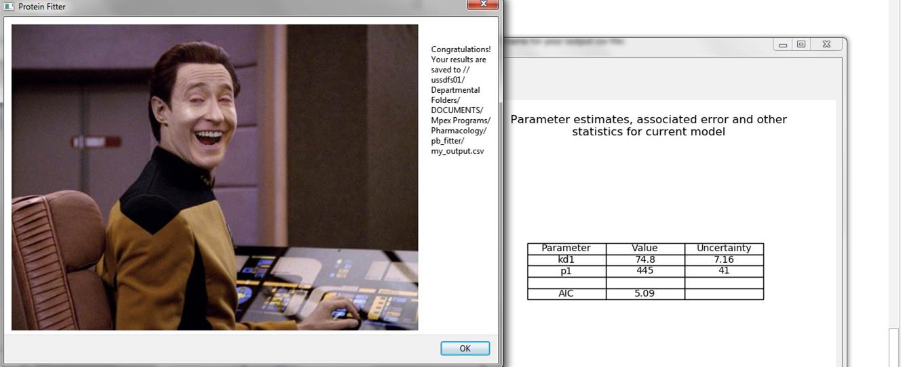

# binding_site_fitter
Python / C++ GUI application for fitting binding site data

PB_Fitter is a simple GUI calculator for fitting protein binding data for drugs to one- and two-binding site models, saving the
resulting model and using it to calculate free drug for pharmacokinetic data. It's easy and intuitive to use and automatically
provides the statistics you need to evaluate the quality of the fit. It was developed for use by the pharmacology team at Qpex
Bio.

## Installation

Currently PBFitter is ready to run on Linux. Activate your preferred Python environment. Running `install_deps.sh` will
install the needed dependencies using pip. To run, enter the following:

```
chmod +x run_pb_fitter.sh
./run_pb_fitter.sh
```

I just finished building a frozen double-click-to-run Windows 10 version which will be under releases shortly.

## Quick start

Measuring the plasma protein binding of a drug is important for determining what fraction of it will be "free" in your bloodstream
at any given time, which has a significant impact on the behavior of the drug in your system. As drug concentrations increase,
the percent bound will increase as binding is saturated. Typically there are multiple proteins in the bloodstream the drug will
bind to, but usually only one or two have a significant impact on the bound fraction. Usually when modeling this behavior
it is customary to approximate by assuming only one or two binding sites -- an approximation, but typically a reasonably good one.

For those of you who are interested in the details...PB_Fitter fits your protein binding data to either 1- or 2- binding site models using whatever weighting you specify. Both models are derived from the law of mass action and mass balance. For a 1-binding site model, we find the roots of a quadratic, and the positive root corresponds to the free drug as a function of total. For a 2-binding site model, we find the roots of a cubic, and only one of these is real and positive; this one corresponds to the free drug as a function of total. To find the roots of the cubic, I use QR matrix factorization on the companion matrix of the polynomial; this is implemented in C++ for speed (the np.roots routine in numpy can only find roots for one polynomial at a time). We fit using L-BFGS and find the parameter error by inverting the Hessian and using the standard formula; we also calculate AIC and plot the residuals (see below).

When you run the program, you'll see the following screen:



Click on “Import new protein binding dataset” to import PB data (there’s some test data you can use under the “Test Data” folder). Change the options under “model fitting options” to whatever you want then click “Fit/Plot protein binding data”. It’s pretty fast – you’ll get these screens:



If you like what you see, you can save the model to a file (under Model Options) and click “Load Saved Model” to load the same model any time you want to use it again. You can also save the plot and error table to disk or change the plot title and axis labels using the toolbar over the plot (the disk icon is to Save, the crooked arrow icon will let you change plot title and axis etc.)

 

If there is a problem during fitting, the application will let you know:



Once you’ve loaded a model, you can calculate free drug for a PK study by clicking on the “Run Calculations for PK Data” button. The program will ask you to select a file containing your PK data, then ask you to indicate a name for your output csv file:



And then indicate success, unless there was an error:



And that's really all there is to it. The program will tell you what your input files need to look like and guide you every step of the way.

